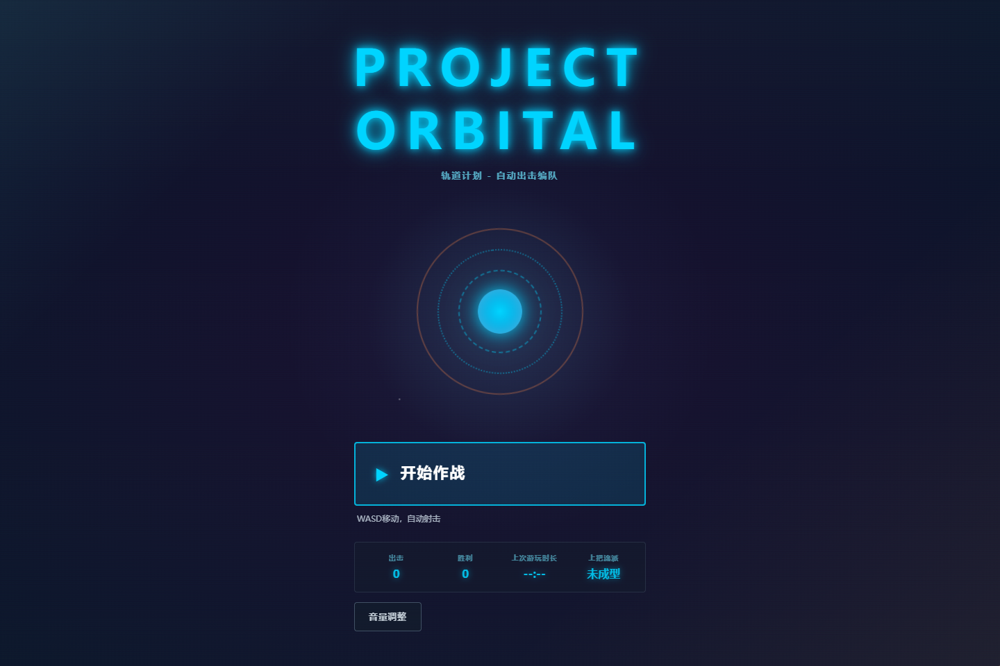
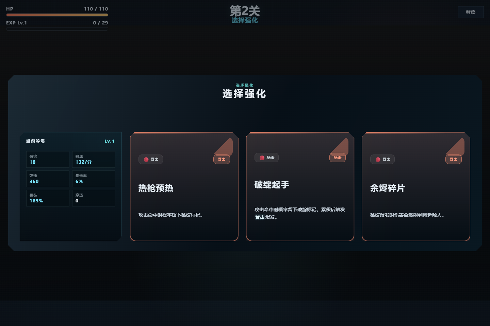
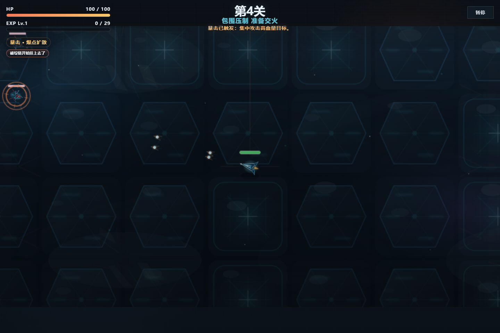
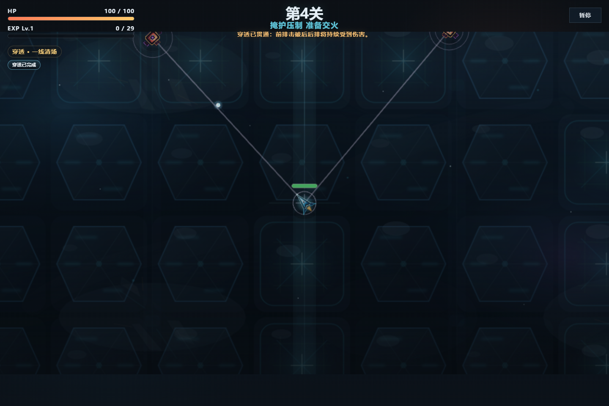
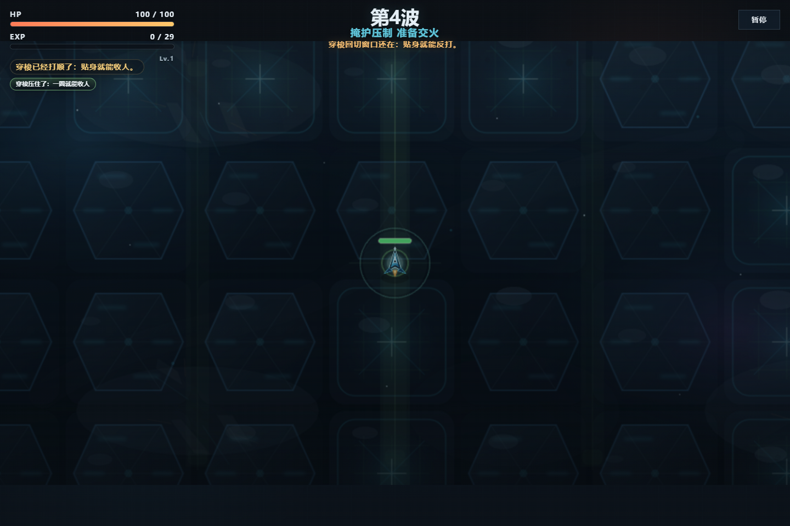
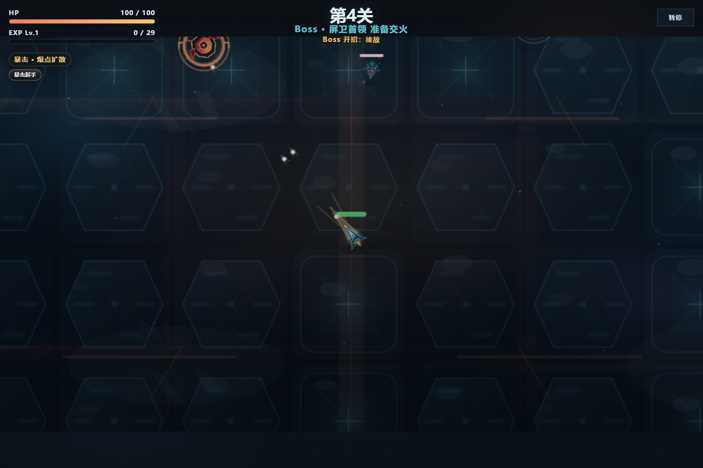
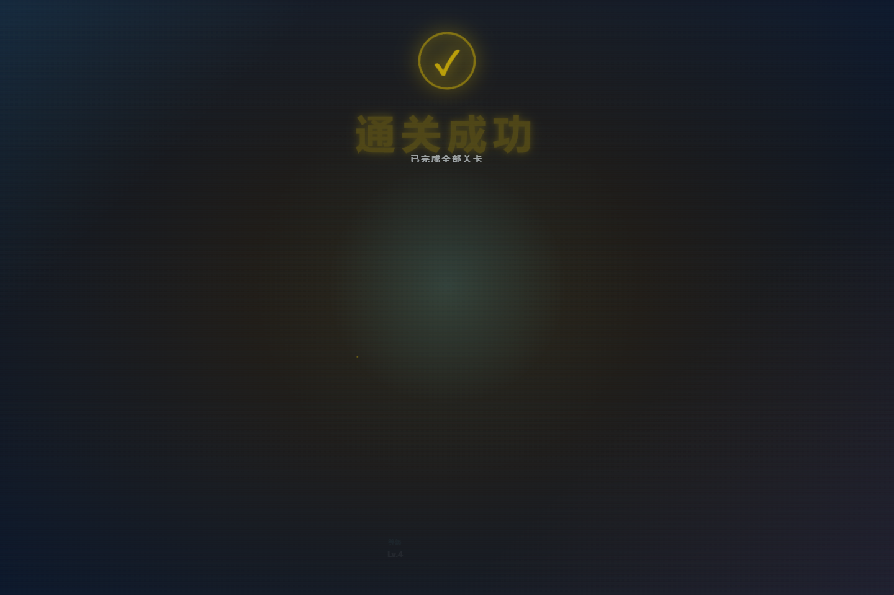

# PROJECT ORBITAL / 轨道计划 - 自动出击编队
短局肉鸽自动射击原型。玩家负责走位和路线选择，角色负责自动攻击，五轮一局，最后用 Boss 做收口。

## 直达链接
- 在线试玩: <https://suwki.github.io/game-demo/>
- 演示视频: 待补充
- 仓库地址: <https://github.com/SuWki/game-demo>

## 这是什么
- 自动攻击 + 手动走位
- 五轮短局闭环
- 三条路线：`crit / pierce / dash`
- Boss 作为最终检定
- 已有 `QA smoke + natural fullrun` 验证链

## 我负责什么 / AI 负责什么
我负责目标设计、规则取舍、问题判断和验收。AI 负责实现、拆分、迭代和补细节。最后是否收口、怎么取舍，仍然由我判断。

## 精选截图
| 首页 | 强化页 | crit payoff |
| --- | --- | --- |
|  |  |  |
| pierce payoff | dash payoff | Boss signature |
|  |  |  |
| 结果页复盘 |  |  |
|  |  |  |

## 运行
- `npm install`
- `npm run dev`

## 备注
- 这是一个展示向的短局原型，不是完整商业游戏。
- 更多设计和验证记录见 `doc/` 与 `progress.md`。
